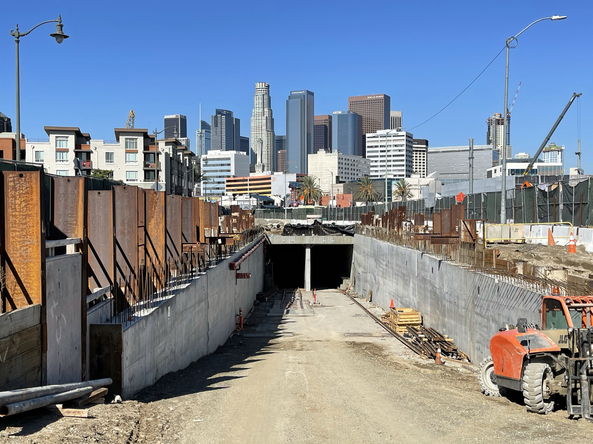
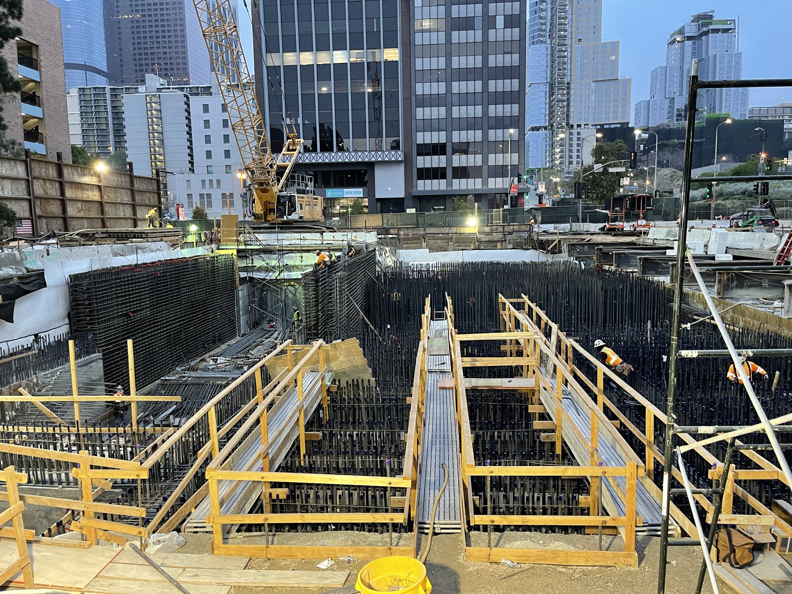
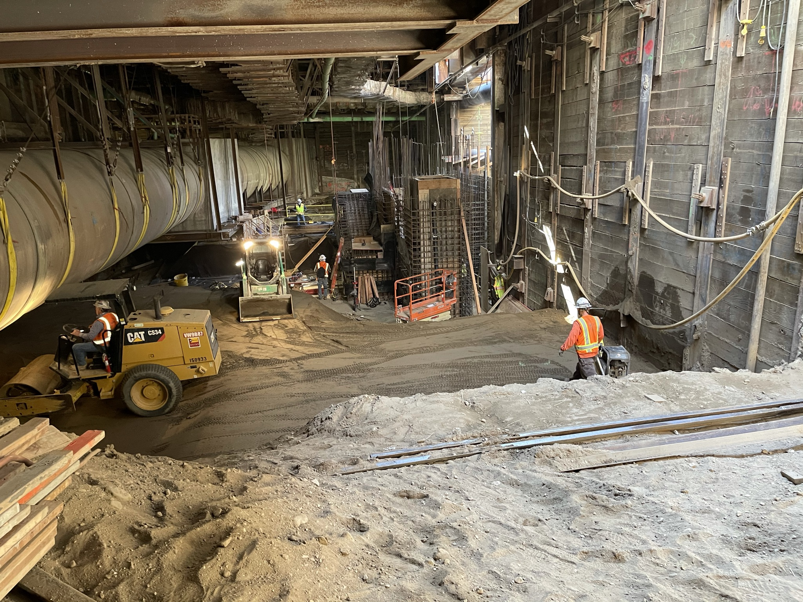
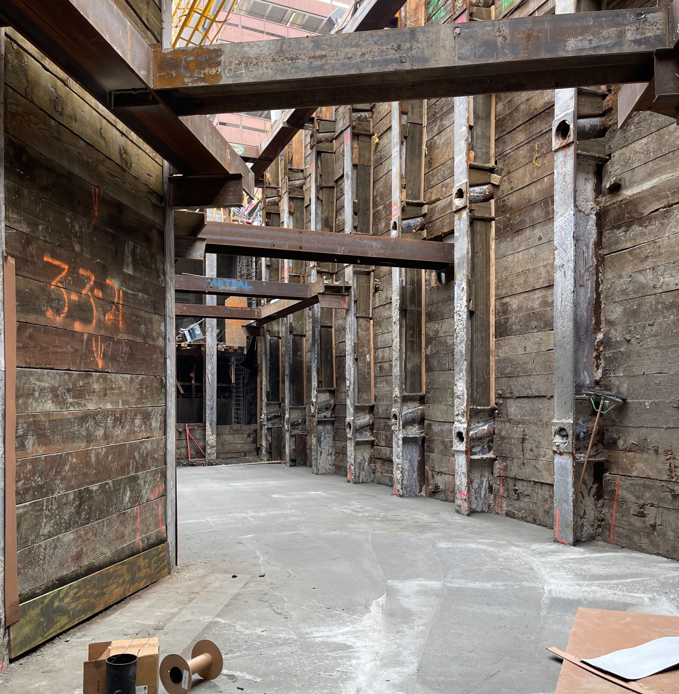

Over Spring 2021, I was thrilled to complete a Heavy Civil Engineering Internship at Traylor Bros. Inc. I worked on the [Regional Connector Project](https://en.wikipedia.org/wiki/Regional_Connector) for the LA Metro. This billion dollar project involved using a tunnel boring machine to create an underground train line to provide a seamless ride across Los Angeles. I assisted in the construction of the [Historic Broadway Station](https://en.wikipedia.org/wiki/Historic_Broadway_station).

**
Entrance to the Regional Connector Tunnel System
**

Leaving the cornfields of rural Iowa and Illinois for the bustling city of Los Angeles was both exciting and nerve-wracking! One unforgettable moment was when I mistakenly instructed a construction crew to tear down a portion of a wall to locate a missing grout box, only to discover it wasn't there 😬. Despite such hiccups, I gained invaluable experience in large-scale project management. Our team managed all operations for the entire site, coordinating nearly 100 construction workers every day. I produced as-builts for the site's grout sealing boxes, managed a 7-figure concrete masonry unit subcontractor's daily operation, produced build staging plans for the sites multi-level air ventilation system, and documented daily construction updates delivered directly to project leadership.

**
Morning Rebar Forest
**

Working on the Historic Broadway station at 2nd and Broadway in Downtown Los Angeles was an incredible experience. One particularly challenging task involved pouring a concrete air vent path at a 45-degree angle. As the concrete started to pour, we quickly realized that buoyant forces hadn't been considered in the form design. The forms floated and broke in several places, causing a massive concrete leak. This taught me a lot about quick thinking and problem-solving in a fast-paced environment.

**
10ft Diameter Storm Drain Around 40ft Underground
**

Overall, this internship was a significant learning experience that provided me with valuable insights into the heavy civil industry and its operational practices. It was a wild ride, but one that I wouldn't trade for anything!

**
North East Side Ventilation Shaft
**